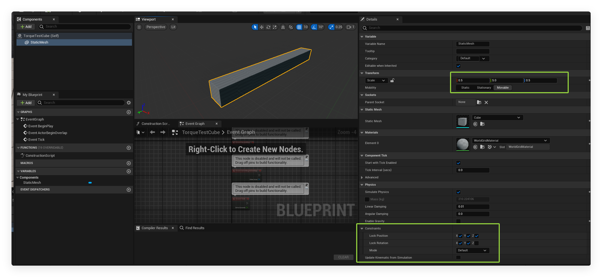

### Exercise 10.4

Implement a torque generator that tries to keep its object spinning at a particular
angular velocity. It should have a target angular velocity. If the current rotation is far
from that target, it should apply a large torque. As the object nears its target angular velocity, the torque should drop. To calculate how near the angular velocity is to the
target, you will need to use the scalar product (but be careful about scaling).


### Solution

I implement it in **Unreal Engine 5.3**. The gif below visualizes the experiment result.

Please refer to  [TorqueGenerator.h](Code_Ex10_4\TorqueGenerator.h)  and  [TorqueGenerator.cpp](Code_Ex10_4\TorqueGenerator.cpp) .


### Key formulas and implementation overview

**Pseudocode**

```pascal
Function ApplyTorque(DeltaTime):
    // Compute the Euclidean distance between current and target angular velocities
    TorqueStrength = Clamp(EuclideanDist(CurrentAngularVelocity, TargetAngularVelocity) * MaxTorque * TorqueFalloffFactor, -MaxTorque, MaxTorque)

    If RootComponent Exists:
        // Apply torque in the direction of the difference between target and current angular velocities
        Torque = Normalize(TargetAngularVelocity - CurrentAngularVelocity) * Abs(TorqueStrength)
        ApplyTorqueToObject(RootComponent, Torque)

```


**Euclidean Distance (in Angular Velocity Space)**:
 The Euclidean distance in 3D space between the current and target angular velocities is calculated using the formula:
$$
\text{EuclideanDist} = \| \mathbf{v}_{\text{current}} - \mathbf{v}_{\text{target}} \|
$$
where:

- $\mathbf{v}_{\text{current}}$ is the current angular velocity vector.
- $\mathbf{v}_{\text{target}}$ is the target angular velocity vector.
- $\| \cdot \|$ represents the Euclidean norm (magnitude) of the vector.

**Torque Magnitude**:
 The torque strength is calculated using the Euclidean distance and is scaled by `MaxTorque` and `TorqueFalloffFactor`:
$$
\text{TorqueStrength} = \text{Clamp} \left( \text{EuclideanDist} \times \text{MaxTorque} \times \text{TorqueFalloffFactor}, -\text{MaxTorque}, \text{MaxTorque} \right)
$$

- The **EuclideanDist** represents the magnitude of the difference between the current and target angular velocities, and this difference is scaled by the maximum torque and falloff factor.

**Torque Direction**:
 The direction of the torque is calculated by normalizing the difference between the target and current angular velocities:
$$
\mathbf{T}_{\text{direction}} = \frac{\mathbf{v}_{\text{target}} - \mathbf{v}_{\text{current}}}{\| \mathbf{v}_{\text{target}} - \mathbf{v}_{\text{current}} \|}
$$

- This ensures that the torque is applied in the direction that reduces the difference in angular velocity.

**Final Torque**:
 The final torque vector is calculated as the product of the torque direction and strength:
$$
\mathbf{T} = \mathbf{T}_{\text{direction}} \times \left| \text{TorqueStrength} \right|
$$

### Parameter setup

| **Parameter**            | **Description**                                              | **Semantics**                                                |
| ------------------------ | ------------------------------------------------------------ | ------------------------------------------------------------ |
| `TargetAngularVelocity`  | The desired angular velocity the object should maintain.     | Specifies the target angular velocity (in degrees per second) to be achieved by the object. |
| `MaxTorque`              | The maximum torque that can be applied to the object.        | Defines the upper limit for the torque applied to the object (in Newton-meters). |
| `TorqueFalloffFactor`    | A factor that determines how quickly torque decreases as the angular velocity approaches the target. | Controls how much the torque reduces as the object approaches the target angular velocity. |
| `CurrentAngularVelocity` | The current angular velocity of the object (calculated at runtime). | Represents the current rotational speed of the object in degrees per second. |

1. Experiment does over scale of a cuboid actor of scale `(0.5, 5.0, 0.5)`, it locks position and rotation.
2. For parameters defined in `TorqueGenerator.h`:
   1. Target Angular Velocity is `0, 0, 30`
   2. The Max torque is set to  100
   3. Torque Fall of factor sets to 0.1

