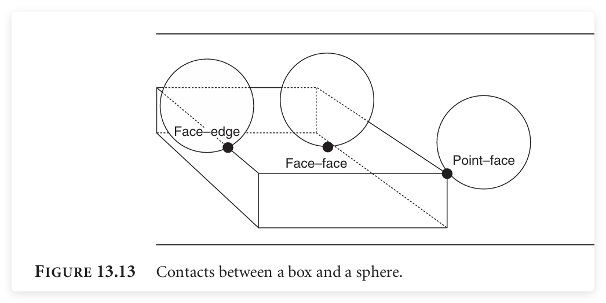

### Exercise 13.2

 What is the maximum number of contacts we’d need to represent the collision between a cube and a cylinder?

### Solution

**Recall**:



1. A vertex–face contact (in our top-priority group) will be generated if a vertex of the box is touching the surface of the sphere. 
2. An edge–face contact (in our second group) is generated if the edge of the box is touching the surface of the sphere. 
3. A face–face contact (again in our second group) is generated if the sphere is touching one side of the box.

Theoretically, there is 8 + 12 + 6 = 24 maximal in all. But I am not fine with that answer, I check the algorithm from the book attached code repo:

#### Implementation in practice: 

Code from: `unsigned CollisionDetector::boxAndSphere` [link](https://github.com/idmillington/cyclone-physics/blob/d75c8d9edeebfdc0deebe203fe862299084b1e30/src/collide_fine.cpp#L585)

```

unsigned CollisionDetector::boxAndSphere(
    const CollisionBox &box,
    const CollisionSphere &sphere,
    CollisionData *data
    )
{
    // Transform the centre of the sphere into box coordinates
    Vector3 centre = sphere.getAxis(3);
    Vector3 relCentre = box.transform.transformInverse(centre);

    // Early out check to see if we can exclude the contact
    if (real_abs(relCentre.x) - sphere.radius > box.halfSize.x ||
        real_abs(relCentre.y) - sphere.radius > box.halfSize.y ||
        real_abs(relCentre.z) - sphere.radius > box.halfSize.z)
    {
        return 0;
    }

    Vector3 closestPt(0,0,0);
    real dist;

    // Clamp each coordinate to the box.
    dist = relCentre.x;
    if (dist > box.halfSize.x) dist = box.halfSize.x;
    if (dist < -box.halfSize.x) dist = -box.halfSize.x;
    closestPt.x = dist;

    dist = relCentre.y;
    if (dist > box.halfSize.y) dist = box.halfSize.y;
    if (dist < -box.halfSize.y) dist = -box.halfSize.y;
    closestPt.y = dist;

    dist = relCentre.z;
    if (dist > box.halfSize.z) dist = box.halfSize.z;
    if (dist < -box.halfSize.z) dist = -box.halfSize.z;
    closestPt.z = dist;

    // Check we're in contact
    dist = (closestPt - relCentre).squareMagnitude();
    if (dist > sphere.radius * sphere.radius) return 0;

    // Compile the contact
    Vector3 closestPtWorld = box.transform.transform(closestPt);

    Contact* contact = data->contacts;
    contact->contactNormal = (closestPtWorld - centre);
    contact->contactNormal.normalise();
    contact->contactPoint = closestPtWorld;
    contact->penetration = sphere.radius - real_sqrt(dist);
    contact->setBodyData(box.body, sphere.body,
        data->friction, data->restitution);

    data->addContacts(1);
    return 1;
}
```


### Step-by-Step Collision Detection Process

#### 1. **Transform Sphere Center to Box Coordinates**

The first key step in the algorithm is to transform the **center of the sphere** into the **box's (cube's)** local coordinate system.

```
Vector3 center = sphere.getAxis(3);
Vector3 relCenter = box.transform.transformInverse(center);
```

- **Transforming coordinates**: The center of the sphere is given in world coordinates (global space), but the box is in a local coordinate system. To make collision checks easier, we transform the sphere's center from world space to the box's local space using the `transformInverse` method. This means we are working with the sphere relative to the cube, simplifying the detection process.

#### 2. **Early Exit Check**

The next step is to perform an **early exit check** to determine if the sphere is outside the box. If the sphere is too far from the box, no collision is possible, and we can avoid unnecessary calculations.

```
if (real_abs(relCentre.x) - sphere.radius > box.halfSize.x ||
    real_abs(relCentre.y) - sphere.radius > box.halfSize.y ||
    real_abs(relCentre.z) - sphere.radius > box.halfSize.z)
{
    return 0;  // No collision
}
```

- **Distance check**: For each dimension (x, y, z), the algorithm checks if the distance between the sphere's center and the closest point on the box (after transforming to box coordinates) is greater than the sphere's radius. If this condition is true for any axis, the sphere is too far from the box, and no collision occurs. The function returns 0 to indicate that no collision is detected.

#### 3. **Clamp Coordinates to Box Limits**

Next, the algorithm calculates the **closest point** on the box to the sphere’s center. This step involves clamping the sphere’s center coordinates to the box's bounds in each dimension (x, y, z).

```
Vector3 closestPt(0,0,0);
real dist;

dist = relCentre.x;
if (dist > box.halfSize.x) dist = box.halfSize.x;
if (dist < -box.halfSize.x) dist = -box.halfSize.x;
closestPt.x = dist;

dist = relCentre.y;
if (dist > box.halfSize.y) dist = box.halfSize.y;
if (dist < -box.halfSize.y) dist = -box.halfSize.y;
closestPt.y = dist;

dist = relCentre.z;
if (dist > box.halfSize.z) dist = box.halfSize.z;
if (dist < -box.halfSize.z) dist = -box.halfSize.z;
closestPt.z = dist;
```

- **Clamping**: Each coordinate of the sphere’s center (in the box's local coordinates) is clamped to be within the limits of the box’s half-sizes (`box.halfSize`). The half-sizes represent half of the box’s dimensions along each axis (x, y, z). The `clamp` ensures that the closest point does not go beyond the box's bounds.

#### 4. **Check if Sphere and Box are in Contact**

After clamping, we calculate the distance between the sphere's center and the closest point on the box:

```
dist = (closestPt - relCentre).squareMagnitude();
if (dist > sphere.radius * sphere.radius) return 0;
```

- **Distance calculation**: The `squareMagnitude()` function calculates the squared distance between the sphere's center (`relCentre`) and the closest point (`closestPt`) on the box.
- **Collision detection**: The squared distance is compared to the squared radius of the sphere (`sphere.radius * sphere.radius`). If the distance is greater than the sphere’s radius, it means the sphere and the box do not collide, and the function exits by returning 0.

#### 5. **Contact Calculation**

If a collision is detected (i.e., the sphere's center is close enough to the box), the algorithm calculates the contact point, normal, and penetration depth:

```
Vector3 closestPtWorld = box.transform.transform(closestPt);

Contact* contact = data->contacts;
contact->contactNormal = (closestPtWorld - centre);
contact->contactNormal.normalise();
contact->contactPoint = closestPtWorld;
contact->penetration = sphere.radius - real_sqrt(dist);
contact->setBodyData(box.body, sphere.body,
    data->friction, data->restitution);
```

- **Transforming back to world coordinates**: The closest point on the box (`closestPt`) is transformed back to world space (`closestPtWorld`) using the box's transformation matrix (`box.transform.transform()`).
- **Contact normal**: The contact normal is calculated as the direction from the sphere’s center (`centre`) to the closest point on the box (`closestPtWorld`). This normal is then normalized.
- **Contact point**: The contact point is set to the transformed closest point on the box (`closestPtWorld`).
- **Penetration depth**: The penetration depth is calculated as the difference between the sphere’s radius and the distance from the sphere's center to the closest point on the box. This tells how much the sphere is penetrating the box.
- **Contact data**: The contact information is stored in the `Contact` object, which includes the contact normal, contact point, penetration depth, and material properties (friction, restitution). The `setBodyData()` function is used to associate the contact with the cube and sphere objects and provide friction and restitution values.

#### 6. **Return the Contact**

Finally, the algorithm adds the contact to the collision data and returns 1, indicating that one contact has been detected:

```
data->addContacts(1);
return 1;
```

### Summary of Collision Detection Steps

1. **Transform the sphere's center** into the box’s local coordinate system.
2. **Check if the sphere is too far** from the box using an early exit check.
3. **Clamp** the sphere's position to the nearest point inside the box's bounds.
4. **Check for contact** by calculating the distance between the sphere's center and the closest point on the box.
5. **If a collision is detected**, calculate the contact point, normal, penetration depth, and store the contact data.
6. **Return the result** indicating whether a contact was detected.

### Conclusion

The algorithm checks for a collision between a cube (or box) and a sphere by transforming the sphere’s center to the box’s local coordinates, clamping the coordinates to the box’s bounds, and then checking if the sphere intersects the box. If a collision is detected, the algorithm calculates the contact information and returns it for further handling, such as resolving the collision in the physics engine.