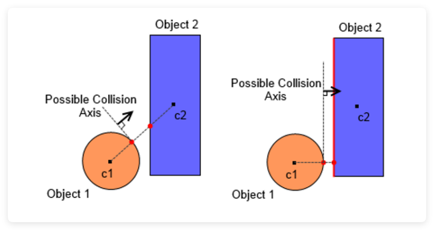

### Exercise 13.5 

What set of axes would you need to test in order to perform an SAT between a box and asphere?

### Solution

In fact, the implementation between a cube and a triangle follows: find the closest point on the cube to the sphere’s centre. Then compute the vector between the sphere centre and that closest point. If the length of that vector > sphere radius → no collision. This is simpler and efficient.

In this case, 1 axes is enough.

### From the perspective of SAT:

1. **6 Axes from the Box:**
   - These axes are the normals to the 6 faces of the box. These axes are essential because if the box faces are parallel or nearly parallel to the separating axis, we might find that the objects don't intersect along that axis.
2. **3 Axes from the Sphere’s Surface:**
   - These are the axes along the directions of the sphere’s contact points with the box’s edges. Each edge of the box might potentially separate the sphere, so we need to test axes along the edges of the box as well.
3. **9 Axes from the Cross Product of the Box’s Edges and Sphere’s Contact Points:**
   - These axes result from cross products between the edges of the box and the vector from the box's center to the sphere’s center. This is where the box and sphere can have interactions through edge-to-edge contact (box edges and the surface of the sphere). These axes account for the interactions between the shape of the box and the spherical shape, which is essential.

### Total Axes:

- 6 axes from the box (face normals)
- 9 axes from the cross-products of box edges and the sphere's center-to-center vector
- 1 axis from the sphere (the center-to-center vector, to account for the sphere’s movement relative to the box)

But if we look deeper, The **cross products** between the box’s axes and the center-to-center vector do **not introduce new independent axes** because the directions of these cross products are already captured by the **6 face normals** of the box. These cross products would merely correspond to axes already covered by the 6 box axes and the center-to-center vector.

### Reference

1. [Physics Tutorial 4: Collision Detection](https://research.ncl.ac.uk/game/mastersdegree/gametechnologies/previousinformation/physics4collisiondetection/2017%20Tutorial%204%20-%20Collision%20Detection.pdf)