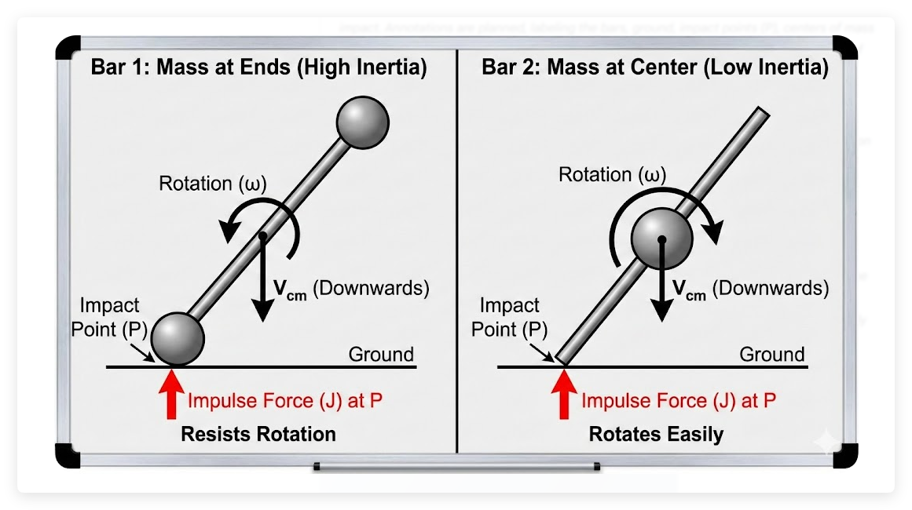

### Exercise 14.4 

Imagine identical collisions between the ground and two straight metal bars. The collisions are configured so that only one end of the bar hits the ground. The first bar has all its mass concentrated at its ends, and the second has its mass concentrated in the center.

1. After the collision, the point of contact will be separating. For which bar will the separation speed be greater (assuming both have the same coefficient of restitution)?
2. After the collision, both centers of mass continue to move downward. Which center of mass will be moving faster?

### Solution

### Part 1: The Separation Speed

Correct Answer: Both bars have the same separation velocity.

The Reasoning:

The definition of the Coefficient of Restitution ($e$) is strictly kinematic. It relates the relative speeds of the points of contact immediately before and after the collision.

$$
v_{separation} = e \times v_{approach}
$$

Since the problem states that the collisions are "identical" (implying the same approach velocity) and they have the same $e$, the separation speed of the point touching the ground depends **only** on these factors.

The mass distribution (inertia) affects the *forces* required to achieve this speed, but it does not change the kinematic definition of the separation speed itself.

------

### Part 2: The Center of Mass (COM) Velocity

Correct Answer: Bar 2 (mass at center) will be moving faster downward.

The Reasoning:

To change the velocity of the Center of Mass, the ground must exert an Impulse ($J$) (force over time) on the bar.

$$
J = \Delta p = m(v_{final} - v_{initial})
$$

To find out which COM moves faster, we need to calculate which bar experiences a *larger* impulse from the ground.

#### 1. Moment of Inertia ($I$)

- **Bar 1 (Mass at ends):** High Moment of Inertia ($I_{high}$). It resists rotation strongly.
- **Bar 2 (Mass at center):** Low Moment of Inertia ($I_{low}$). It rotates very easily.

#### 2. The Mechanics of the Impact

When the tip of the bar hits the ground, the ground pushes up. This push does two things:

1. It pushes the COM upward (Linear Momentum).
2. It spins the bar (Angular Momentum).

We recall the relationship between the velocity change at the tip ($\Delta v_{tip}$) and Impulse ($J$):

$$
\Delta v_{tip} = J \left( \frac{1}{m} + \frac{r^2}{I} \right)
$$

*Note: $r$ is the distance from the COM to the impact point.*

We know $\Delta v_{tip}$ is the **same** for both bars (because $e$ is the same, see Part 1). Therefore, we can solve for Impulse $J$:

$$
J = \frac{\Delta v_{tip}}{\frac{1}{m} + \frac{r^2}{I}}
$$

#### 3. Comparing the Bars

- **Bar 2 (Low $I$):** The term $\frac{r^2}{I}$ is huge. This makes the denominator large, which makes the Impulse $J$ **small**.
  - *Intuition:* Because the mass is concentrated in the center, the bar spins "out of the way" easily upon impact. The ground doesn't have to push very hard to satisfy the coefficient of restitution.
- **Bar 1 (High $I$):** The term $\frac{r^2}{I}$ is small. This makes the denominator small, which makes the Impulse $J$ **large**.
  - *Intuition:* The bar resists spinning. The ground has to push it very hard to get the tip to reverse velocity.

#### 4. The Result

Bar 1 receives a large upward push. This slows down its downward COM velocity significantly (or might even bounce it upward).

Bar 2 receives a small upward push. Its COM is barely affected; it mostly just starts spinning while continuing to fall.

**Therefore, Bar 2 retains more of its downward speed and moves faster.**

### Appendix: proof of impulse and velocity formula

We need to find the relationship between the **Impulse ($J$)** applied at the tip of the bar and the resulting **change in velocity at that tip ($\Delta v_{tip}$)**.

We define the upward direction as positive (+).

##### Step 1: Linear Motion (Newton's Second Law)

When an impulse $J$ (force $\times$ time) acts on the bar, it changes the linear velocity of the Center of Mass (COM), denoted as $v_{cm}$.

$$
	J = m \Delta v_{cm}
$$

Rearranging for velocity:

$$
	\Delta v_{cm} = \frac{J}{m}
$$

##### Step 2: Rotational Motion (Angular Impulse)

The impulse acts at the tip, which is a distance $r$ from the Center of Mass. This creates a torque (moment) that changes the angular velocity ($\omega$).

$$
	\text{Angular Impulse} = \text{Change in Angular Momentum}
$$

$$
	J \cdot r = I \Delta \omega
$$

Rearranging for angular velocity:

$$
	\Delta \omega = \frac{J \cdot r}{I}
$$

##### Step 3: Kinematics of the Tip

The velocity of the tip of the bar is the sum of the translational velocity of the COM and the rotational velocity at the tip ($v = r\omega$).

$$
	v_{tip} = v_{cm} + r\omega
$$

Therefore, the change in the tip's velocity is:

$$
	\Delta v_{tip} = \Delta v_{cm} + r \Delta \omega
$$

##### Step 4: Substitution

Substitute the equations from Step 1 and Step 2 into the equation from Step 3:

$$
	\Delta v_{tip} = \left( \frac{J}{m} \right) + r \left( \frac{J \cdot r}{I} \right)
$$

##### Step 5: Solve for J

Factor out $J$:

$$
	\Delta v_{tip} = J \left( \frac{1}{m} + \frac{r^2}{I} \right)
$$

Divide by the term in the brackets to isolate $J$:

$$
J = \frac{\Delta v_{tip}}{\frac{1}{m} + \frac{r^2}{I}}
$$

##### Physical Interpretation

- **$\frac{1}{m}$**: Represents the resistance to linear motion.
- **$\frac{r^2}{I}$**: Represents the resistance to rotational motion (lever arm effect).
- **The Sum**: The total "effective" resistance the ground feels when pushing the bar.